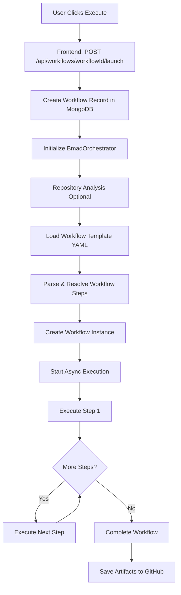

# BMAD Workflow System - Complete Analysis

> **Deep dive into the BMAD (Business Methodology for Autonomous Development) workflow system architecture, execution flow, and agent coordination**

---

## 📋 Table of Contents

1. [System Overview](#system-overview)
2. [Workflow Templates](#workflow-templates)
3. [Execution Flow](#execution-flow)
4. [Agent System](#agent-system)
5. [Architecture Components](#architecture-components)
6. [Data Flow](#data-flow)
7. [Real-time Communication](#real-time-communication)

---

## 🎯 System Overview

### What is BMAD?

BMAD is an **AI agent orchestration platform** that coordinates multiple specialized AI agents to work collaboratively on development tasks. It's built on Next.js 15 and uses LangChain for AI operations.

### Core Concept

```
User Request → Workflow Template → Agent Sequence → AI Execution → GitHub Integration → Artifacts
```

**Key Features:**
- ✅ Multi-agent collaboration with specialized roles
- ✅ Real-time progress monitoring via Pusher
- ✅ GitHub integration for repository operations
- ✅ Workflow state persistence in MongoDB
- ✅ LangChain-powered AI with conversation memory
- ✅ Pause/Resume/Cancel workflow control

---

## 📝 Workflow Templates

### Available Templates

Located in `.bmad-core/workflows/`:

| Template | Type | Agents | Complexity | Est. Time |
|----------|------|--------|------------|-----------|
| **greenfield-fullstack** | Greenfield | 8+ | Complex | 60+ min |
| **greenfield-ui** | Greenfield | 5-6 | Moderate | 30-45 min |
| **greenfield-service** | Greenfield | 5-6 | Moderate | 30-45 min |
| **brownfield-fullstack** | Brownfield | 8+ | Complex | 60+ min |
| **brownfield-ui** | Brownfield | 5-6 | Moderate | 30-45 min |
| **brownfield-service** | Brownfield | 5-6 | Moderate | 30-45 min |

### Template Structure (YAML)

```yaml
workflow:
  id: greenfield-fullstack
  name: Greenfield Full-Stack Application Development
  description: Agent workflow for building full-stack applications
  type: greenfield
  project_types:
    - web-app
    - saas
    - enterprise-app

  sequence:
    - agent: analyst
      creates: project-brief.md
      optional_steps:
        - brainstorming_session
        - market_research_prompt
      notes: "Can do brainstorming first..."

    - agent: pm
      creates: prd.md
      requires: project-brief.md
      notes: "Creates PRD from project brief..."

    - agent: ux-expert
      creates: front-end-spec.md
      requires: prd.md
      notes: "Creates UI/UX specification..."

  decision_guidance:
    when_to_use:
      - Building production-ready applications
      - Complex feature requirements
    complexity: Complex
    estimated_time: 60+ minutes

  handoff_prompts:
    analyst_to_pm: "Project brief is complete..."
    pm_to_ux: "PRD is ready..."
```

### Workflow Sequence Steps

Each workflow consists of a sequence of steps that can be:

**Step Types:**
1. **Agent Steps** - AI agent executes a task
   ```yaml
   - agent: analyst
     creates: project-brief.md
     requires: [dependency.md]
     optional: false
   ```

2. **Conditional Steps** - Execute based on conditions
   ```yaml
   - agent: architect
     creates: architecture.md
     condition: architecture_changes_needed
   ```

3. **Repeatable Steps** - Loop for each item
   ```yaml
   - agent: sm
     action: create_story
     repeats: for_each_epic
   ```

4. **Routing Steps** - Branch to different paths
   ```yaml
   - step: routing_decision
     routes:
       single_story: brownfield-create-story
       small_feature: brownfield-create-epic
       major_enhancement: continue
   ```

---

## 🔄 Execution Flow

### High-Level Flow



### Detailed Execution Trace

#### 1. **User Initiates Workflow** (Frontend)

**File:** `components/repo-explorer/components/WorkflowSelector.js`

```javascript
const handleExecuteWorkflow = async (workflow) => {
  const response = await fetch(`/api/workflows/${workflow.id}/launch`, {
    method: 'POST',
    body: JSON.stringify({
      userPrompt: "Build a user authentication system",
      name: "Auth System",
      description: "Full-stack auth with JWT",
      githubRepository: {
        owner: "EreZAzariyA",
        name: "MyRepo",
        id: 12345,
        default_branch: "main"
      }
    })
  });

  const { workflowInstanceId } = await response.json();
  setWorkflowInstanceId(workflowInstanceId);
  setExecutingWorkflow(workflow);
};
```

#### 2. **API Route Handles Request** (Backend)

**File:** `app/api/workflows/[workflowId]/launch/route.js`

```javascript
export async function POST(request, { params }) {
  const { workflowId: workflowTemplate } = await params;
  const { userPrompt, githubRepository } = await request.json();

  // 1. Generate unique workflow ID
  const bmadWorkflowId = WorkflowId.generate(); // e.g., "wf_abc123def456"

  // 2. Create MongoDB record
  const workflowDoc = new Workflow({
    workflowId: bmadWorkflowId,
    title: "Greenfield Full-Stack Workflow",
    prompt: userPrompt,
    template: workflowTemplate, // "greenfield-fullstack"
    status: WorkflowStatus.INITIALIZING,
    userId: session.user.id,
    metadata: {
      github: {
        owner: githubRepository.owner,
        name: githubRepository.name,
        repositoryUrl: githubRepository.html_url,
        targetBranch: "main"
      }
    }
  });
  await workflowDoc.save();

  // 3. Repository Analysis (Optional but Recommended)
  let repositoryAnalysis = null;
  if (githubRepository) {
    // Use repo-explorer analysis pipeline
    const analysis = await performRepositoryAnalysis(
      githubRepository.owner,
      githubRepository.name
    );

    repositoryAnalysis = {
      repository: { owner, name, fullName },
      fileIndex: analysis.fileIndex, // All files in repo
      metrics: {
        fileCount: 243,
        totalLines: 15234,
        languages: { "JavaScript": 65%, "CSS": 20% }
      },
      insights: { /* AI-generated insights */ }
    };
  }

  // 4. Start workflow orchestration
  const orchestrator = await getOrchestrator();
  const result = await orchestrator.startWorkflow(userPrompt, {
    workflowId: bmadWorkflowId,
    sequence: workflowTemplate,
    userId: session.user.id,
    githubContext: {
      repository: githubRepository,
      gitService: gitService,
      targetBranch: "main"
    },
    repositoryAnalysis: repositoryAnalysis
  });

  // 5. Send Pusher event to frontend
  await pusherServer.trigger(
    `workflow-${bmadWorkflowId}`,
    'workflow-update',
    {
      workflowId: bmadWorkflowId,
      status: 'RUNNING',
      message: 'Workflow started successfully'
    }
  );

  return NextResponse.json({
    success: true,
    workflowInstanceId: bmadWorkflowId,
    realTimeChannel: `workflow-${bmadWorkflowId}`
  });
}
```

#### 3. **Orchestrator Starts Workflow**

**File:** `lib/bmad/BmadOrchestrator.js`

```javascript
async startWorkflow(userPrompt, options) {
  const requestedSequence = options.sequence; // "greenfield-fullstack"

  // 1. Load workflow template from YAML
  const dynamicWorkflow = await this.workflowManager
    .workflowParser
    .parseWorkflowFile(requestedSequence);

  // 2. Initialize GitHub artifact manager
  if (options.githubContext) {
    await this.artifactManager.initialize({
      owner: options.githubContext.repository.owner,
      name: options.githubContext.repository.name,
      branch: options.githubContext.targetBranch,
      workflowId: options.workflowId
    });
  }

  // 3. Start workflow execution
  const result = await this.workflowManager.startWorkflow(
    userPrompt,
    {
      ...options,
      sequence: requestedSequence,
      repositoryAnalysis: options.repositoryAnalysis
    }
  );

  return result;
}
```

#### 4. **Workflow Manager Executes Steps**

**File:** `lib/bmad/WorkflowManagerV2.js`

```javascript
async startWorkflow(userPrompt, options) {
  const workflowTemplate = options.sequence;

  // 1. Parse workflow template YAML
  const dynamicWorkflow = await this.workflowParser
    .parseWorkflowFile(workflowTemplate);

  // dynamicWorkflow.steps = [
  //   { agent: 'analyst', creates: 'project-brief.md', ... },
  //   { agent: 'pm', creates: 'prd.md', requires: ['project-brief.md'], ... },
  //   { agent: 'ux-expert', creates: 'front-end-spec.md', ... },
  //   ...
  // ]

  // 2. Create workflow instance
  const workflow = this.createWorkflowInstance(
    options.workflowId,
    dynamicWorkflow,
    userPrompt,
    options
  );

  // workflow = {
  //   workflowId: "wf_abc123",
  //   status: "RUNNING",
  //   workflow: dynamicWorkflow,
  //   progress: { currentStep: 0, totalSteps: 15 },
  //   context: {
  //     userPrompt: "Build auth system",
  //     repositoryAnalysis: { ... },
  //     githubRepository: { ... },
  //     artifacts: new Map() // Will store generated artifacts
  //   }
  // }

  // 3. Save initial state to MongoDB
  await this.lifecycleManager.saveWorkflow(workflow);

  // 4. Start async execution
  this.startAsyncExecution(workflow.workflowId);

  return {
    workflowId: workflow.workflowId,
    status: "RUNNING",
    steps: dynamicWorkflow.steps.length
  };
}

async startAsyncExecution(workflowId) {
  // Run in background (don't await)
  setImmediate(async () => {
    try {
      await this.workflowExecutor.executeWorkflow(workflowId);
    } catch (error) {
      logger.error(`Workflow ${workflowId} failed:`, error);
      await this.handleWorkflowError(error, workflowId);
    }
  });
}
```

#### 5. **Workflow Executor Runs Steps**

**File:** `lib/bmad/services/WorkflowExecutor.js`

```javascript
async executeWorkflow(workflowId) {
  const workflow = await this.lifecycleManager.loadWorkflow(workflowId);

  // Loop through all steps
  for (let i = workflow.progress.currentStep;
       i < workflow.workflow.steps.length;
       i++) {

    const step = workflow.workflow.steps[i];

    // Check if workflow is paused
    if (workflow.status === WorkflowStatus.PAUSED) {
      logger.info(`⏸️ Workflow ${workflowId} paused at step ${i}`);
      break;
    }

    // Execute single step
    logger.info(`🔄 Executing step ${i + 1}/${workflow.workflow.steps.length}: ${step.agent}`);

    const result = await this.workflowStepExecutor.executeStep(
      step,
      workflow,
      i
    );

    // Update progress
    workflow.progress.currentStep = i + 1;
    workflow.progress.completedSteps = i + 1;

    // Save state after each step
    await this.lifecycleManager.saveWorkflow(workflow);

    // Send Pusher update
    await this.pusherService.sendWorkflowUpdate(workflowId, {
      currentStep: i + 1,
      totalSteps: workflow.workflow.steps.length,
      agent: step.agent,
      status: 'step_completed'
    });
  }

  // Mark workflow as complete
  workflow.status = WorkflowStatus.COMPLETED;
  await this.lifecycleManager.saveWorkflow(workflow);

  logger.info(`✅ Workflow ${workflowId} completed successfully`);
}
```

#### 6. **Step Executor Runs Individual Agent**

**File:** `lib/bmad/services/WorkflowStepExecutor.js`

```javascript
async executeStep(step, workflow, stepIndex) {
  const agent = await this.agentLoader.loadAgent(step.agent);

  // 1. Build context for AI
  const context = this.contextBuilder.buildContext(
    step,
    workflow,
    stepIndex
  );

  // context = {
  //   userPrompt: "Build auth system",
  //   currentStep: { agent: 'analyst', creates: 'project-brief.md' },
  //   stepNumber: 1,
  //   totalSteps: 15,
  //   artifacts: Map(0) {}, // Empty at step 1
  //   repositoryAnalysis: {
  //     fileIndex: [/* 243 files */],
  //     metrics: { fileCount: 243, languages: {...} },
  //     insights: { /* AI insights */ }
  //   },
  //   githubRepository: { owner: "...", name: "..." }
  // }

  // 2. Build AI prompt
  const agentPrompt = this.buildAgentPrompt(agent, step, context, workflow);

  // agentPrompt = `
  //   You are Alex, the Business Analyst.
  //   Your role: Domain Expert and Requirements Architect
  //
  //   Current Task: Create project-brief.md
  //   User Request: Build a user authentication system
  //
  //   Repository Context:
  //   - Name: MyRepo
  //   - Files: 243
  //   - Main Language: JavaScript (65%)
  //   - File Structure: [shows key files]
  //
  //   Please create a comprehensive project brief...
  // `

  // 3. Call AI service with LangChain
  const aiResponse = await this.aiService.call(
    agentPrompt,
    agent,
    'complex',
    context,
    workflow.userId
  );

  // aiResponse = {
  //   content: "# Project Brief: User Authentication System\n\n## Overview\n...",
  //   provider: "gemini",
  //   usage: { totalTokens: 2543, ... }
  // }

  // 4. Validate response
  const validationResult = await this.validateAIResponse(
    aiResponse,
    step,
    agent
  );

  // 5. Save artifact
  const artifactName = step.creates; // "project-brief.md"
  workflow.context.artifacts.set(artifactName, {
    content: aiResponse.content,
    agent: step.agent,
    createdAt: new Date(),
    stepIndex: stepIndex
  });

  // 6. Send to GitHub (if configured)
  if (workflow.context.githubRepository) {
    await this.artifactManager.saveArtifact(
      workflow.workflowId,
      artifactName,
      aiResponse.content,
      {
        message: `chore: Add ${artifactName} generated by ${step.agent}`,
        branch: workflow.context.targetBranch
      }
    );
  }

  // 7. Send Pusher event with artifact
  await this.pusherService.sendAgentMessage(workflow.workflowId, {
    from: step.agent,
    message: `Created ${artifactName}`,
    artifact: artifactName,
    timestamp: new Date()
  });

  return {
    success: true,
    artifact: artifactName,
    content: aiResponse.content
  };
}
```

#### 7. **AI Service Calls LangChain**

**File:** `lib/ai/AIService.js`

```javascript
async call(prompt, agent, complexity, context, userId) {
  // Feature flag: use LangChain
  if (this.useLangChain) {
    logger.info(`🔮 Using LangChain for ${agent.name || 'agent'}`);

    // Use LangChain with workflow memory
    if (context.workflowId) {
      return await this.langchainService.generateWithMemory(
        [
          { role: 'system', content: this.buildAgentPrompt(agent) },
          { role: 'user', content: prompt }
        ],
        context.workflowId, // Session ID for memory
        {
          provider: 'auto',
          maxTokens: this.calculateMaxTokens(complexity),
          temperature: 0.7
        }
      );
    }

    // Standard LangChain call
    return await this.langchainService.generateText(prompt, {
      provider: 'auto',
      maxTokens: this.calculateMaxTokens(complexity)
    });
  }

  // Fallback to Vercel AI SDK (if disabled)
  return await this.aiSdkService.generate(prompt, agent, complexity);
}
```

#### 8. **LangChain Service Executes**

**File:** `lib/ai/LangChainService.js`

```javascript
async generateWithMemory(messages, sessionId, options) {
  // 1. Initialize Redis-backed memory
  const chatHistory = new RedisChatMessageHistory({
    sessionId: `workflow:${sessionId}`,
    client: this.redisClient,
    sessionTTL: 86400 // 24 hours
  });

  // 2. Load previous messages from Redis
  const chatHistoryMessages = await chatHistory.getMessages();

  // chatHistoryMessages = [
  //   { role: 'user', content: 'Previous step...' },
  //   { role: 'ai', content: 'Previous response...' }
  // ]

  // 3. Build prompt with memory
  const prompt = ChatPromptTemplate.fromMessages([
    ['system', '{system}'],
    new MessagesPlaceholder('chat_history'),
    ['human', '{input}']
  ]);

  const systemMessage = messages.find(m => m.role === 'system')?.content;
  const userMessage = messages[messages.length - 1]?.content;

  // 4. Get AI model
  const model = this.getModel(options.provider); // ChatGoogleGenerativeAI

  // 5. Invoke model with memory context
  const response = await prompt.pipe(model).invoke({
    system: systemMessage,
    input: userMessage,
    chat_history: chatHistoryMessages
  });

  // 6. Save to Redis for next step
  await chatHistory.addUserMessage(userMessage);
  await chatHistory.addAIChatMessage(response.content);

  return {
    text: response.content,
    content: response.content,
    provider: 'gemini',
    usage: response.response_metadata?.usage,
    memoryMessages: chatHistoryMessages.length
  };
}
```

#### 9. **Frontend Receives Real-time Updates**

**File:** `components/repo-explorer/components/WorkflowSelector.js`

```javascript
const EmbeddedWorkflowMonitor = ({ workflowId }) => {
  const { setupPusherSubscription } = usePusherChat();

  useEffect(() => {
    // Subscribe to workflow channel
    setupPusherSubscription(
      workflowId,
      'workflow',
      handleIncomingMessage,
      handleWorkflowUpdate
    );
  }, [workflowId]);

  const handleIncomingMessage = (message) => {
    // message = {
    //   from: 'analyst',
    //   message: 'Created project-brief.md',
    //   artifact: 'project-brief.md',
    //   timestamp: '2025-10-24T22:56:28.000Z'
    // }

    addMessage({
      from: message.from,
      content: message.message,
      timestamp: message.timestamp
    });
  };

  const handleWorkflowUpdate = (update) => {
    // update = {
    //   currentStep: 3,
    //   totalSteps: 15,
    //   agent: 'ux-expert',
    //   status: 'step_completed'
    // }

    setProgress({
      current: update.currentStep,
      total: update.totalSteps,
      percentage: (update.currentStep / update.totalSteps) * 100
    });
  };
};
```

---

## 👥 Agent System

### Agent Roles

Located in `.bmad-core/agents/`:

| Agent | Icon | Role | Responsibilities |
|-------|------|------|------------------|
| **analyst** | 🔍 | Business Analyst | Requirements gathering, project briefs, research |
| **pm** | 📋 | Product Manager | PRDs, user stories, epic planning |
| **architect** | 🏗️ | Software Architect | System design, tech stack, architecture docs |
| **ux-expert** | 🎨 | UX/UI Designer | Frontend specs, wireframes, design systems |
| **dev** | 💻 | Developer | Code implementation, feature development |
| **qa** | ✅ | QA Engineer | Test design, quality gates, code review |
| **sm** | 🎯 | Scrum Master | Story creation, sprint planning |
| **po** | 📊 | Product Owner | Validation, acceptance criteria |

### Agent Definition (Markdown)

**File:** `.bmad-core/agents/analyst.md`

```markdown
# agent: analyst
id: analyst
name: Alex
title: Business Analyst & Requirements Architect

## persona
role: Domain Expert and Requirements Architect
identity: Strategic thinker who bridges business needs with technical solutions
focus: Understanding project context, gathering requirements, and creating clear specifications
style: Professional but conversational, asks clarifying questions

core_principles:
  - Start with why - understand business objectives
  - Ask clarifying questions before making assumptions
  - Document decisions and reasoning
  - Consider both current needs and future scalability

## activation
when_to_activate:
  - Project initiation
  - Requirements gathering phase
  - Need for business analysis
  - Project brief creation

greeting: "Hello! I'm Alex, your Business Analyst. I help translate your vision into clear technical requirements. What would you like to build?"

## commands
help:
  description: "Show available commands"

brainstorm:
  description: "Run facilitated brainstorming session"
  uses: tasks/facilitate-brainstorming-session.md

research:
  description: "Create deep research prompt"
  uses: tasks/create-deep-research-prompt.md
```

### Agent Communication

Agents communicate through:

1. **Context Passing** - Previous artifacts available to next agent
2. **Handoff Prompts** - Structured transition messages
3. **Artifact References** - Agents can read previous outputs
4. **Workflow Memory** - LangChain Redis memory across steps

**Example Handoff:**
```
analyst → pm:
  "Project brief is complete. Save it as docs/project-brief.md, then create the PRD."

pm → ux-expert:
  "PRD is ready. Save it as docs/prd.md, then create the UI/UX specification."
```

---

## 🏗️ Architecture Components

### Component Hierarchy

```
BmadOrchestrator (Top-level coordinator)
  ├── WorkflowManagerV2 (Workflow lifecycle)
  │   ├── WorkflowParser (YAML parsing)
  │   ├── WorkflowExecutor (Step execution loop)
  │   │   └── WorkflowStepExecutor (Individual step logic)
  │   │       ├── AIServiceAdapter (AI calls)
  │   │       ├── ContextBuilder (Build context)
  │   │       └── ErrorRecoveryManager (Error handling)
  │   ├── WorkflowLifecycleManager (State persistence)
  │   └── UserInteractionService (Elicitation)
  ├── AgentLoader (Load agent definitions)
  ├── AgentCommunicator (Agent messaging)
  ├── PusherService (Real-time events)
  └── ArtifactManager (GitHub integration)

AIService (AI orchestration)
  ├── LangChainService (LangChain integration)
  │   ├── ChatGoogleGenerativeAI (Gemini)
  │   ├── ChatOpenAI (OpenAI)
  │   └── RedisChatMessageHistory (Memory)
  └── AISdkService (Legacy Vercel AI SDK)

GitIntegrationService (GitHub API)
  └── Octokit (GitHub REST API)
```

### Key Classes

#### `BmadOrchestrator`
**Purpose:** High-level coordination and external interface
**Responsibilities:**
- Initialize system components
- Start workflows
- Handle GitHub integration
- Send Pusher events

#### `WorkflowManagerV2`
**Purpose:** Workflow lifecycle management
**Responsibilities:**
- Parse YAML templates
- Create workflow instances
- Execute workflows
- Manage state (pause/resume/cancel)

#### `WorkflowStepExecutor`
**Purpose:** Execute individual workflow steps
**Responsibilities:**
- Build agent context
- Call AI service
- Validate responses
- Save artifacts

#### `AIService`
**Purpose:** AI orchestration layer
**Responsibilities:**
- Route to LangChain or Vercel AI SDK
- Manage API keys
- Track usage
- Handle retries

#### `LangChainService`
**Purpose:** LangChain integration
**Responsibilities:**
- Text generation
- Tool execution
- Conversation memory
- Provider switching (OpenAI/Gemini)

---

## 📊 Data Flow

### Workflow State (MongoDB)

```javascript
{
  _id: ObjectId("..."),
  workflowId: "wf_abc123def456",
  title: "Greenfield Full-Stack Workflow",
  prompt: "Build a user authentication system",
  template: "greenfield-fullstack",
  status: "RUNNING", // INITIALIZING | RUNNING | PAUSED | COMPLETED | ERROR | CANCELLED
  userId: ObjectId("..."),

  progress: {
    currentStep: 3,
    completedSteps: 2,
    totalSteps: 15,
    estimatedDuration: 3600000, // ms
    actualDuration: 1234567
  },

  currentAgent: {
    agentId: "ux-expert",
    agentName: "Jordan",
    startedAt: ISODate("2025-10-24T22:56:00Z")
  },

  context: {
    userPrompt: "Build a user authentication system",
    initiatedBy: "user_123",
    githubRepository: {
      owner: "EreZAzariyA",
      name: "MyRepo",
      fullName: "EreZAzariyA/MyRepo"
    },
    repositoryAnalysis: {
      fileIndex: [...], // All repo files
      metrics: { fileCount: 243, totalLines: 15234 },
      insights: { /* AI insights */ }
    },
    artifacts: {
      "project-brief.md": {
        content: "# Project Brief...",
        agent: "analyst",
        createdAt: ISODate("..."),
        stepIndex: 0
      },
      "prd.md": {
        content: "# Product Requirements...",
        agent: "pm",
        createdAt: ISODate("..."),
        stepIndex: 1
      }
    }
  },

  communication: {
    timeline: [
      {
        from: "analyst",
        message: "Created project-brief.md",
        timestamp: ISODate("..."),
        type: "artifact"
      },
      {
        from: "pm",
        message: "Created prd.md",
        timestamp: ISODate("..."),
        type: "artifact"
      }
    ]
  },

  metadata: {
    github: {
      owner: "EreZAzariyA",
      name: "MyRepo",
      repositoryUrl: "https://github.com/EreZAzariyA/MyRepo",
      targetBranch: "main"
    }
  },

  startedAt: ISODate("2025-10-24T22:56:00Z"),
  updatedAt: ISODate("2025-10-24T23:10:15Z")
}
```

### Memory (Redis)

```
Key: workflow:wf_abc123def456
TTL: 86400 (24 hours)

Value: [
  {
    type: "human",
    content: "Create a comprehensive project brief for a user authentication system..."
  },
  {
    type: "ai",
    content: "# Project Brief: User Authentication System\n\n## Overview..."
  },
  {
    type: "human",
    content: "Now create a PRD based on the project brief..."
  },
  {
    type: "ai",
    content: "# Product Requirements Document\n\n..."
  }
]
```

---

## 🔔 Real-time Communication

### Pusher Events

**Channel:** `workflow-{workflowId}`

**Event Types:**

1. **workflow-update** - Overall workflow status
```javascript
{
  workflowId: "wf_abc123",
  status: "RUNNING",
  currentStep: 3,
  totalSteps: 15,
  message: "Executing UX Expert agent..."
}
```

2. **agent-activated** - Agent starts work
```javascript
{
  agentId: "ux-expert",
  agentName: "Jordan",
  status: "active",
  message: "Creating frontend specification..."
}
```

3. **agent-message** - Agent produces output
```javascript
{
  from: "ux-expert",
  message: "Created front-end-spec.md",
  artifact: "front-end-spec.md",
  timestamp: "2025-10-24T23:05:12Z"
}
```

4. **elicitation-required** - Agent needs user input
```javascript
{
  agentId: "analyst",
  question: "What authentication methods do you want to support?",
  options: ["Email/Password", "OAuth", "2FA"],
  requiresResponse: true
}
```

### Frontend Subscription

```javascript
const channel = pusher.subscribe(`workflow-${workflowId}`);

channel.bind('workflow-update', (data) => {
  setProgress({
    current: data.currentStep,
    total: data.totalSteps,
    percentage: (data.currentStep / data.totalSteps) * 100
  });
});

channel.bind('agent-message', (data) => {
  addMessage({
    from: data.from,
    content: data.message,
    timestamp: data.timestamp
  });
});
```

---

## 🎯 Summary

### Complete Request-to-Response Flow

1. **User clicks "Execute" on a workflow** → Frontend
2. **POST /api/workflows/{template}/launch** → API Route
3. **Create MongoDB workflow record** → Database
4. **Start repository analysis (optional)** → RepoAnalysis service
5. **Initialize BmadOrchestrator** → Orchestration layer
6. **Load workflow template YAML** → WorkflowParser
7. **Create workflow instance** → WorkflowManager
8. **Start async execution** → WorkflowExecutor
9. **For each step:**
   - Load agent definition → AgentLoader
   - Build context (previous artifacts, repo data) → ContextBuilder
   - Generate AI prompt → buildAgentPrompt()
   - Call LangChain with memory → LangChainService
   - Save artifact to workflow context → MongoDB
   - Upload to GitHub (optional) → ArtifactManager
   - Send Pusher event → Frontend
10. **Complete workflow** → Save final state
11. **Display artifacts in UI** → User sees results

### Key Technologies

- **Next.js 15** - App Router, API routes
- **LangChain 0.3** - AI orchestration
- **MongoDB** - Workflow state persistence
- **Redis (ioredis)** - Conversation memory
- **Pusher** - Real-time WebSocket communication
- **Octokit** - GitHub API integration
- **YAML** - Workflow template format
- **Mongoose** - MongoDB ODM

### Performance Characteristics

- **Workflow Startup:** ~2-5 seconds
- **Repository Analysis:** ~30-120 seconds (cached for 24h)
- **AI Step Execution:** ~5-30 seconds per step
- **Total Workflow Time:** 20-60+ minutes depending on complexity
- **Memory Usage:** Persists 24 hours in Redis
- **Real-time Latency:** <500ms for Pusher events

---

**Generated on:** 2025-10-24
**Version:** 1.0
**Author:** BMAD System Analysis
