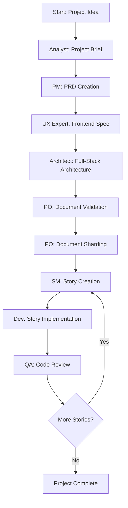

# Deep Dive Analysis of the .bmad-core System

## System Architecture Overview

The **BMAD (Business Methodology for Autonomous Development)** system is a sophisticated AI agent orchestration platform that coordinates multiple specialized AI agents in structured workflows for software development projects.

## Core Structure

### Directory Organization
- **agents/**: 10 specialized AI agents with distinct personas and capabilities
- **workflows/**: Predefined workflow sequences (greenfield, brownfield variants)
- **agent-teams/**: Agent bundles for different project types
- **templates/**: YAML templates for document generation
- **tasks/**: Executable workflow tasks
- **checklists/**: Validation and quality assurance lists
- **data/**: Knowledge base and technical preferences
- **utils/**: Workflow management utilities

## The Agents Explained

### 1. **Scrum Master (Bob)** - `sm.md`
**Role**: Story creation specialist and agile process coordinator
**Key Functions**:
- Creates detailed user stories using `create-next-story` task
- Follows rigorous story preparation procedures
- Ensures stories have complete context for AI developers
- **Critical Rule**: Cannot implement stories or modify code - only prepares stories
- **Commands**: `*draft`, `*correct-course`, `*story-checklist`
- **Focus**: Bridge between planning and development phases

### 2. **BMAD Orchestrator** - `bmad-orchestrator.md`
**Role**: Master coordinator and agent transformation engine
**Key Functions**:
- **Dynamic Agent Transformation**: Can become any other agent on demand
- **Workflow Coordination**: Guides users through multi-agent workflows
- **Resource Management**: Loads files only when needed (lazy loading)
- **Command Interface**: Provides unified interface to all BMAD capabilities
- **Party Mode**: Enables group chat with all agents
- **Commands**: `*agent`, `*workflow`, `*workflow-guidance`, `*kb-mode`, `*party-mode`
- **Critical Feature**: Never pre-loads resources - discovers and loads at runtime

### 3. **Business Analyst (Mary)** - `analyst.md`
**Role**: Strategic analyst and ideation partner
**Key Functions**:
- Market research and competitive analysis
- Brainstorming facilitation using structured techniques
- Project brief creation from ideas
- Strategic contextualization of requirements
- **Commands**: `*create-project-brief`, `*perform-market-research`, `*brainstorm`
- **Focus**: Research planning and strategic insights

### 4. **Product Manager (John)** - `pm.md`
**Role**: Product strategy and requirements documentation
**Key Functions**:
- Creates PRDs (Product Requirements Documents)
- Manages brownfield project epic/story creation
- Product strategy and feature prioritization
- **Commands**: `*create-prd`, `*create-brownfield-prd`, `*shard-prd`
- **Core Principles**: User-focused, data-driven decisions, MVP focus

### 5. **Architect (Winston)** - `architect.md`
**Role**: Holistic system architect and technical leader
**Key Functions**:
- Full-stack architecture design
- Technology selection and system design
- API design and infrastructure planning
- **Commands**: `*create-full-stack-architecture`, `*create-backend-architecture`
- **Philosophy**: User experience drives architecture, progressive complexity

### 6. **Developer (James)** - `dev.md`
**Role**: Implementation specialist
**Key Functions**:
- Story implementation following strict procedures
- Sequential task execution with comprehensive testing
- **Critical Rules**: 
  - Only updates specific story sections (Dev Agent Record)
  - Cannot modify story requirements or acceptance criteria
  - Must follow `develop-story` command sequence
- **Command**: `*develop-story` (primary workflow)
- **Focus**: Precision execution with minimal context overhead

### 7. **UX Expert** - `ux-expert.md`
**Role**: User experience design specialist
**Key Functions**:
- Frontend specifications and UI/UX design
- User research and interface design
- AI prompt generation for UI tools (v0, Lovable)
- **Commands**: `*create-front-end-spec`, `*generate-ai-frontend-prompt`
- **Focus**: User-centered design and interface specifications

### 8. **QA Engineer** - `qa.md`
**Role**: Quality assurance and code review specialist
**Key Functions**:
- Senior developer review with refactoring capabilities
- Code quality assessment and improvement
- Test strategy and validation
- **Commands**: `*review-story`, `*refactor-code`
- **Focus**: Code quality, testing, and technical debt management

### 9. **Product Owner (PO)** - `po.md`
**Role**: Product validation and document coordination
**Key Functions**:
- Document validation and consistency checking
- Epic and story validation
- Artifact sharding and organization
- **Commands**: `*validate-artifacts`, `*shard-documents`, `*master-checklist`
- **Focus**: Product integrity and document quality

### 10. **BMAD Master** - `bmad-master.md`
**Role**: Unified agent with all capabilities except implementation
**Key Functions**:
- Can perform any task except story implementation
- Knowledge base access and BMad Method explanation
- Context compaction and conversation management
- **Commands**: All agent commands except `*develop-story`
- **Focus**: Unified interface for non-development tasks

## Workflow Orchestration

### Planning Phase (Web UI Recommended)
1. **Analyst**: Creates project brief, market research, brainstorming
2. **PM**: Develops PRD with epics and stories
3. **UX Expert**: Creates frontend specifications (optional)
4. **Architect**: Designs comprehensive system architecture
5. **PO**: Validates document alignment and consistency

### Development Phase (IDE)
1. **PO**: Shards documents into consumable pieces
2. **SM**: Creates detailed stories from sharded epics
3. **Dev**: Implements stories following strict task sequences
4. **QA**: Reviews and refactors code (optional)

## Key Innovation: Agent Transformation

The BMAD Orchestrator can dynamically transform into any specialized agent:
```yaml
*agent pm  # Becomes Product Manager
*agent dev # Becomes Developer
*agent sm  # Becomes Scrum Master
```

Each transformation:
- Loads agent-specific persona and capabilities
- Provides access to agent's commands and dependencies
- Maintains agent identity until explicitly exited

## Story-Driven Development

The SM creates self-contained stories that include:
- **Complete Technical Context**: Extracted from architecture docs
- **Sequential Tasks**: Detailed implementation steps
- **Source References**: Every technical detail cites architecture sources
- **Testing Requirements**: Specific test strategies
- **File Structure Guidance**: Exact paths for new code

## Configuration System

**Core Config** (`.bmad-core/core-config.yaml`):
- Defines project structure preferences
- Specifies developer context files (`devLoadAlwaysFiles`)
- Controls document sharding behavior
- Manages workflow customization

## Workflow Types

### Available Workflows
1. **greenfield-fullstack**: Complete new application development
2. **greenfield-service**: Backend service development
3. **greenfield-ui**: Frontend application development
4. **brownfield-fullstack**: Existing application enhancement
5. **brownfield-service**: Existing service enhancement
6. **brownfield-ui**: Existing UI enhancement

### Greenfield Full-Stack Workflow Sequence


## Agent Interaction Patterns

### Command System
- **Command Prefix**: All commands use `*` prefix (`*help`, `*create`, `*workflow`)
- **Numbered Options**: Agents always present choices as numbered lists
- **Lazy Loading**: Resources loaded only when needed
- **Source Attribution**: All technical details cite architecture sources

### Status Tracking
Stories progress through defined states:
- **Draft**: Initial story creation
- **Approved**: Validated and ready for development
- **In Progress**: Currently being implemented
- **Review**: Awaiting quality assurance
- **Done**: Completed and validated

## Key Files and Templates

### Critical Configuration Files
- `.bmad-core/core-config.yaml`: Main configuration
- `.bmad-core/agent-teams/team-*.yaml`: Agent bundle definitions
- `.bmad-core/data/technical-preferences.md`: Technology preferences

### Story Template Structure
- **Story Information**: Title, status, epic reference
- **Requirements**: User story and acceptance criteria
- **Dev Notes**: Technical context from architecture
- **Tasks/Subtasks**: Sequential implementation steps
- **Dev Agent Record**: Implementation tracking and notes
- **Testing**: Validation requirements and results

### Document Sharding
The PO agent creates sharded versions of large documents:
- `docs/prd/` - Individual epic files
- `docs/architecture/` - Architectural components
- Enables focused context loading for agents

## Best Practices

### Context Management
- Keep agent contexts lean and focused
- Load only necessary files for specific tasks
- Use sharded documents for complex projects
- Regular context compaction for long conversations

### Development Workflow
1. Complete planning phase before development
2. Validate all documents for consistency
3. Create detailed stories with complete context
4. Follow strict task sequences during implementation
5. Test and validate at each step
6. Commit changes regularly

### Agent Selection
- **Planning**: Use specialized agents (Analyst, PM, Architect, UX)
- **Coordination**: Use BMAD Orchestrator for multi-agent workflows
- **Development**: Use SM for story creation, Dev for implementation
- **Quality**: Use QA for code review and validation
- **Validation**: Use PO for document and epic validation

## Integration Points

### IDE Integration
- Works with any IDE supporting agent interactions
- Slash commands (`/agent`) or @ symbols (`@agent`)
- File-based communication through markdown documents
- Real-time collaboration through agent handoffs

### External Tools
- **UI Generation**: Integrates with v0, Lovable for AI-generated interfaces
- **Version Control**: Designed around git workflows
- **Testing**: Supports various testing frameworks through architecture configuration
- **Deployment**: Architecture documents include deployment strategies

The BMAD system represents a sophisticated approach to AI-driven development, emphasizing structured workflows, agent specialization, and comprehensive documentation while maintaining flexibility through dynamic agent transformation and configurable workflows.