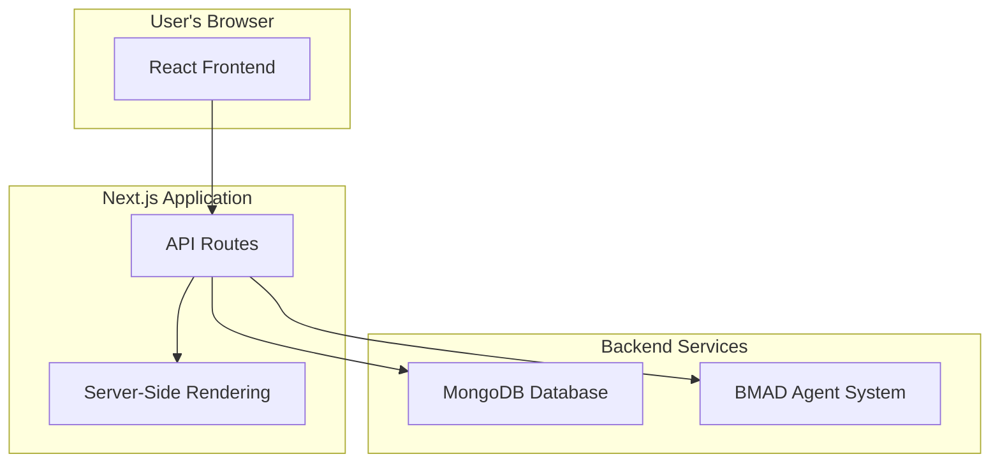

# Full-Stack Architecture: AI Documentation Assistant

## 1. Introduction

This document outlines the full-stack architecture for the AI Documentation Assistant. It covers the frontend, backend, database, and deployment strategy, based on the requirements and technical assumptions defined in the PRD.

### 1.1. Goals and Objectives

*   **Scalability:** The architecture must support a growing number of users and documentation projects.
*   **Maintainability:** The codebase should be easy to understand, modify, and extend.
*   **Performance:** The system must be responsive and provide a seamless user experience.
*   **Security:** The architecture must incorporate security best practices to protect user data.

### 1.2. Scope

This document covers the architecture for the MVP of the AI Documentation Assistant, including the core functionalities defined in the PRD.

## 2. System Overview

### 2.1. High-Level Architecture

The system will be a monolithic application built with Next.js, leveraging its integrated backend capabilities. This approach simplifies development and deployment for the MVP, while allowing for future expansion into a microservices architecture if needed.

### 2.2. Technology Stack

*   **Frontend:** React.js with Next.js
*   **Backend:** Next.js API Routes
*   **Database:** MongoDB
*   **Authentication:** NextAuth.js
*   **Styling:** Tailwind CSS
*   **Deployment:** Vercel

## 3. Frontend Architecture

### 3.1. Component Structure

The frontend will be built using a component-based architecture, with a clear separation of concerns. Components will be organized by feature and type (e.g., `components/auth`, `components/chat`).

### 3.2. State Management

For the MVP, we will use React's built-in state management (useState, useContext) for local component state. For global state management, we will use React Query to manage server state and caching.

### 3.3. Routing

Routing will be handled by Next.js's file-system based router. Public, private, and authenticated routes will be managed using middleware.

## 4. Backend Architecture

### 4.1. API Design

The backend will expose a RESTful API using Next.js API routes. The API will be organized by resource (e.g., `/api/users`, `/api/projects`).

### 4.2. Authentication and Authorization

Authentication will be implemented using NextAuth.js, supporting both email/password and Google OAuth providers. Authorization will be handled using middleware to protect routes and resources.

### 4.3. BMAD Agent Integration

The BMAD agent system will be integrated into the backend. The `BmadOrchestrator` will be responsible for loading and managing agent definitions, and the `WorkflowEngine` will execute the agent workflows.

## 5. Database Architecture

### 5.1. Schema Design

The MongoDB database will have collections for `users`, `projects`, and `documents`.

*   **Users:** Stores user information, including authentication details.
*   **Projects:** Stores information about documentation projects, including the associated Git repository.
*   **Documents:** Stores the generated documentation content.

### 5.2. Data Models

Data models will be defined using Mongoose to provide a clear schema and validation for the data.

## 6. Deployment and Infrastructure

### 6.1. Deployment Strategy

The application will be deployed to Vercel, which provides a seamless deployment experience for Next.js applications. The deployment process will be automated using Git integration.

### 6.2. Environment Configuration

Environment variables will be used to manage configuration for different environments (development, staging, production). These will be managed in Vercel's project settings.

## 7. Security Considerations

### 7.1. Authentication and Authorization

As mentioned, NextAuth.js will be used for secure authentication. All sensitive API routes will be protected.

### 7.2. Data Encryption

Data will be encrypted at rest and in transit. MongoDB Atlas provides encryption at rest by default, and Vercel provides SSL for all deployments.

### 7.3. Input Validation

All user input will be validated on both the client and server to prevent common security vulnerabilities such as XSS and SQL injection.
