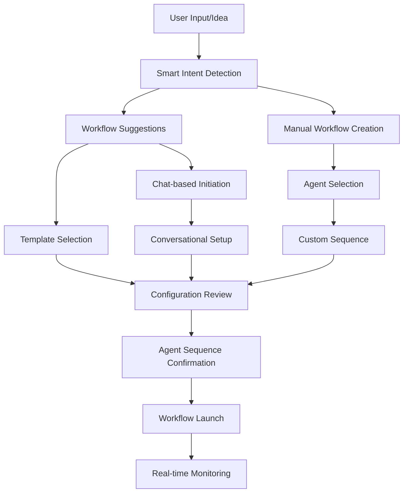
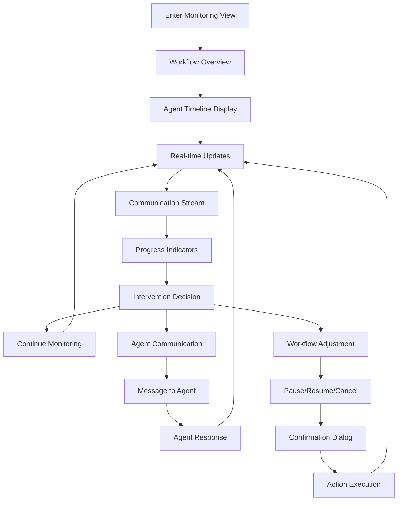

# Dream Team UI/UX Specification

This document defines the user experience goals, information architecture, user flows, and visual design specifications for Dream Team's user interface. It serves as the foundation for visual design and frontend development, ensuring a cohesive and user-centered experience that matches the professional caliber of your AI-powered platform.

---

## Overall UX Goals & Principles

### Target User Personas

**Power User - Technical Development Lead**
- Senior developers, architects, and team leads who manage complex projects
- Needs: Advanced workflow control, detailed progress visibility, multi-project oversight
- Pain Points: Context switching between tools, lack of real-time collaboration visibility
- Goals: Efficient project orchestration, clear agent coordination, minimal cognitive load

**Professional Developer - Individual Contributor**  
- Mid-level developers who execute on projects using AI assistance
- Needs: Clear task guidance, seamless agent handoffs, integrated development workflow
- Pain Points: Tool fragmentation, unclear AI agent capabilities, manual coordination overhead
- Goals: Streamlined development process, intelligent assistance, learning from AI agents

**Project Manager - Non-Technical Stakeholder**
- PMs, product owners, and business stakeholders who oversee development
- Needs: High-level progress visibility, business metric tracking, stakeholder communication
- Pain Points: Technical complexity barriers, lack of business context in dev tools
- Goals: Clear project status, timeline predictability, business value demonstration

### Usability Goals

1. **Rapid Onboarding**: New users can initiate their first AI-powered workflow within 5 minutes
2. **Workflow Efficiency**: Power users can orchestrate complex multi-agent workflows with <3 clicks
3. **Real-time Clarity**: All users understand agent status and progress at any moment
4. **Error Prevention**: Clear validation and confirmation for critical workflow decisions
5. **Professional Confidence**: Users trust the platform for enterprise-critical development work

### Design Principles

1. **Intelligence Made Visible**: AI agent actions and decisions are transparent and understandable
2. **Progressive Complexity**: Show simple overviews by default, reveal details on demand
3. **Real-time Responsiveness**: Every system action provides immediate, clear feedback
4. **Professional Authority**: Visual design conveys expertise, reliability, and enterprise quality
5. **Collaborative Clarity**: Multi-user and multi-agent interactions are always clear and coordinated

---

## Change Log

| Date | Version | Description | Author |
|------|---------|-------------|---------|
| 2025-07-31 | 1.0 | Initial specification creation | UX Expert (Sally) |

---

## Information Architecture (IA)

### Site Map / Screen Inventory

```mermaid
graph TD
    A[Dashboard Hub] --> B[Active Workflows]
    A --> C[System Overview]
    A --> D[Quick Actions]
    
    E[Workflow Management] --> F[Start New Workflow]
    E --> G[Workflow History] 
    E --> H[Template Library]
    E --> I[Live Monitoring]
    
    J[Agent Collaboration] --> K[Multi-Agent Chat]
    J --> L[Agent Status Center]
    J --> M[Communication History]
    
    N[System Admin] --> O[Integrations]
    N --> P[User Management]
    N --> Q[System Health]
    N --> R[Analytics]
    
    S[Knowledge Base] --> T[Generated Artifacts]
    S --> U[Workflow Templates]
    S --> V[Documentation]
    S --> W[Agent Guides]
```



### Navigation Structure

**Primary Navigation:** Hub-and-spoke architecture with Dashboard as central command center, providing contextual access to Workflows (BMAD orchestration), Agents (real-time collaboration), Integrations (external services), and Analytics (performance insights).

**Secondary Navigation:** Context-aware tabs that appear based on current activity - Workflow contexts show Progress/Chat/Artifacts, Agent contexts show Tasks/History/Settings, Admin contexts reveal Users/System/Billing sections.

**Breadcrumb Strategy:** Clear hierarchical paths for complex workflows (Dashboard → Workflows → [Name] → [Agent] → [Task]) with always-available quick escapes to parent contexts and Dashboard.

---

## User Flows

### Workflow Initiation Flow

**User Goal:** Start an AI-powered development workflow from initial idea to agent execution

**Entry Points:** Dashboard quick actions, chat interface workflow detection, template gallery, direct workflow creation

**Success Criteria:** User successfully initiates appropriate workflow with correct agent sequence within 3 clicks

#### Flow Diagram



#### Edge Cases & Error Handling:
- Incomplete project requirements → Guided requirement gathering
- Invalid agent combinations → Smart suggestions with explanations
- Resource availability conflicts → Queue management and scheduling options
- User permission restrictions → Clear messaging with escalation paths

**Notes:** Flow emphasizes progressive disclosure - simple start with option for advanced configuration. Multiple entry points accommodate different user preferences and contexts.

### Real-time Workflow Monitoring Flow

**User Goal:** Monitor active AI agent workflows with real-time visibility into progress, communications, and results

**Entry Points:** Dashboard active workflows, direct workflow URL, notification clicks, agent status updates

**Success Criteria:** User maintains clear understanding of workflow status and can intervene when needed

#### Flow Diagram



#### Edge Cases & Error Handling:
- Agent communication failures → Clear error states with retry options
- Workflow timeout conditions → Automatic notifications with manual intervention choices
- Network disconnection → Offline state indication with reconnection handling
- Concurrent user modifications → Conflict resolution with merge strategies

**Notes:** Emphasizes transparency and control - users always understand current state and have intervention options without disrupting agent coordination.

---

## Component Library / Design System

### Design System Approach

**Professional AI-First Design System** - Built specifically for enterprise AI agent orchestration with emphasis on real-time transparency, professional authority, and complex workflow management. Addresses critical gaps identified in flow validation: resource management, error recovery, business user support, and mobile emergency access.

### Core Components

#### Agent Status Components

**AgentCard**
- **Purpose:** Display real-time agent status with professional authority and immediate recognition
- **Variants:** 
  - Active (pulsing blue border, "Working on..." with progress indicator)
  - Available (green border, "Ready" with resource capacity indicator)
  - Busy (amber border, "Occupied" with queue position)
  - Error (red border, error message with recovery options)
  - Offline (gray border, last seen timestamp)
- **States:** Default, hover (subtle scale+shadow), selected, loading, error
- **Usage Guidelines:** Always show resource availability, include one-click communication access, display current task context

**AgentResourcePanel**
- **Purpose:** Address critical gap in agent availability visibility for power users
- **Variants:** 
  - Overview (all agents with capacity indicators)
  - Detailed (individual agent with queue, estimated availability)
  - Mobile (condensed view with critical info only)
- **States:** Real-time updates, loading skeleton, offline mode
- **Usage Guidelines:** Update every 2 seconds, show queue position, include estimated wait times

#### Workflow Management Components

**WorkflowTimeline**
- **Purpose:** Professional visualization of multi-agent workflow progress with business and technical views
- **Variants:**
  - Technical View (agent tasks, handoffs, technical details)
  - Business View (milestones, percentages, delivery estimates)
  - Mobile View (vertical, touch-optimized)
  - Error Recovery View (checkpoint visibility, recovery options)
- **States:** Active, paused, completed, error, loading
- **Usage Guidelines:** Support view mode toggle, show checkpoints, include intervention points

**MultiWorkflowDashboard**
- **Purpose:** Address critical gap in concurrent workflow management for power users
- **Variants:**
  - Grid View (card-based overview of all workflows)
  - Priority View (sorted by urgency and business impact)
  - Resource View (organized by agent utilization)
- **States:** Real-time status updates, filtering active, drag-and-drop prioritization
- **Usage Guidelines:** Show resource conflicts, include quick action buttons, support bulk operations

#### Communication Components

**AgentChatInterface**
- **Purpose:** Professional multi-participant communication with clear agent-to-agent and human-to-agent distinction
- **Variants:**
  - Full Desktop (sidebar with participants, message history, typing indicators)
  - Mobile Optimized (single column, swipe navigation, voice input support)
  - Emergency Mode (critical messages only, quick response buttons)
- **States:** Connected, reconnecting, offline, typing, waiting for agent response
- **Usage Guidelines:** Color-code by agent role, show message priority, include workflow context

**NotificationCenter**
- **Purpose:** Address gap in user attention management for agent questions and workflow events
- **Variants:**
  - Critical (blocking workflow, requires immediate attention)
  - Important (agent questions, handoff notifications)
  - Informational (progress updates, completions)
- **States:** Unread, read, dismissed, snoozed
- **Usage Guidelines:** Use appropriate urgency indicators, include context switching, support mobile push

#### Error Recovery Components

**ErrorRecoveryWizard**
- **Purpose:** Address critical gap in error handling with step-by-step recovery guidance
- **Variants:**
  - Auto-Recovery (system can resolve automatically)
  - Manual Intervention (requires user decision or action)
  - Escalation Required (technical support needed)
- **States:** Analyzing, options presented, recovery in progress, completed
- **Usage Guidelines:** Show work preservation status, include rollback options, provide clear next steps

**WorkflowCheckpointViewer**
- **Purpose:** Show preserved work and recovery points during failures
- **Variants:**
  - Artifact Viewer (generated documents, code, designs)
  - Progress Snapshot (completed tasks, current state)
  - Recovery Options (restart points, manual takeover)
- **States:** Loading artifacts, displaying content, recovery mode
- **Usage Guidelines:** Highlight recoverable vs. lost work, include export options, show timestamps

#### Business User Components

**ExecutiveDashboard**
- **Purpose:** Address gap in business-friendly workflow visibility for non-technical stakeholders
- **Variants:**
  - High-Level Overview (project status, timelines, key metrics)
  - Detailed Progress (milestone tracking, resource utilization)
  - Report Generation (exportable summaries for stakeholders)
- **States:** Real-time updates, generating reports, historical view
- **Usage Guidelines:** Use business language, include trend indicators, support scheduled reports

**BusinessMetricsCard**
- **Purpose:** Translate technical progress into business-relevant insights
- **Variants:**
  - Timeline Card (estimated completion, milestone progress)
  - Resource Card (team utilization, cost tracking)
  - Quality Card (testing status, risk indicators)
- **States:** Up-to-date, stale data, calculation in progress
- **Usage Guidelines:** Include confidence indicators, show historical trends, use familiar business terminology

#### Mobile Emergency Components

**MobileEmergencyDashboard**
- **Purpose:** Address critical gap in mobile workflow management for urgent situations
- **Variants:**
  - Status Overview (critical workflow health at a glance)
  - Quick Actions (pause, resume, escalate, contact)
  - Alert Triage (prioritized list of issues requiring attention)
- **States:** Normal, urgent, critical, offline
- **Usage Guidelines:** Large touch targets, minimal cognitive load, voice input support

**EmergencyActionPanel**
- **Purpose:** Simplified intervention options for mobile emergency access
- **Variants:**
  - Workflow Control (pause, resume, cancel with confirmation)
  - Agent Communication (quick messages, escalation contacts)
  - Status Broadcasting (update team, notify stakeholders)
- **States:** Available actions, confirmation required, action in progress
- **Usage Guidelines:** Clear action hierarchy, include undo options, support offline queueing

#### Advanced Interaction Components

**SmartWorkflowSuggester**
- **Purpose:** Enhanced intent detection with domain-specific recommendations
- **Variants:**
  - Simple Suggestions (basic workflow recommendations)
  - Advanced Configuration (detailed setup with risk assessment)
  - Domain Specialist (security, finance, healthcare specific options)
- **States:** Analyzing input, presenting options, configured and ready
- **Usage Guidelines:** Show confidence levels, include complexity indicators, explain recommendations

**ResourceConflictResolver**
- **Purpose:** Address agent availability conflicts with intelligent queue management
- **Variants:**
  - Automatic Scheduling (system optimizes agent allocation)
  - Manual Prioritization (user controls workflow priority)
  - Resource Expansion (suggest additional agent instances)
- **States:** Detecting conflicts, presenting options, resolving, scheduled
- **Usage Guidelines:** Show impact of decisions, include time estimates, support priority overrides

---

## Design Token System

### Color Palette - Professional AI Platform

#### Primary Colors
| Color Type | Light Mode | Dark Mode | Usage | Semantic Meaning |
|------------|------------|-----------|--------|------------------|
| **Primary** | `#0066CC` | `#4A9EFF` | Main actions, links, primary CTAs | Trust, reliability, professional authority |
| **Secondary** | `#6366F1` | `#818CF8` | Secondary actions, accent elements | Innovation, intelligence, AI presence |
| **Accent** | `#8B5CF6` | `#A78BFA` | Highlights, special features | Premium features, advanced capabilities |

#### Semantic Colors - AI Agent System
| Color Type | Light Mode | Dark Mode | Usage | Agent Association |
|------------|------------|-----------|--------|-------------------|
| **Success** | `#10B981` | `#34D399` | Completed tasks, positive feedback | Developer Agent, successful workflows |
| **Warning** | `#F59E0B` | `#FBBF24` | Pending actions, caution states | QA Agent, testing phases |
| **Error** | `#EF4444` | `#F87171` | Failures, critical alerts | System errors, failed workflows |
| **Info** | `#06B6D4` | `#22D3EE` | Information, neutral states | Architect Agent, system information |

#### Agent Role Colors - Specialized Theming
| Agent Role | Primary | Secondary | Usage |
|------------|---------|-----------|--------|
| **PM Agent** | `#8B5CF6` | `#A78BFA` | Project management, planning tasks |
| **Architect** | `#06B6D4` | `#22D3EE` | System design, architecture tasks |
| **Developer** | `#10B981` | `#34D399` | Code implementation, development |
| **QA Agent** | `#F59E0B` | `#FBBF24` | Testing, quality assurance |
| **UX Expert** | `#EC4899` | `#F472B6` | Design, user experience tasks |
| **Data Architect** | `#7C3AED` | `#8B5CF6` | Database, data modeling |

#### Neutral Colors - Professional Interface
| Color Type | Light Mode | Dark Mode | Usage |
|------------|------------|-----------|--------|
| **Gray 50** | `#F9FAFB` | `#111827` | Background, subtle surfaces |
| **Gray 100** | `#F3F4F6` | `#1F2937` | Card backgrounds, secondary surfaces |
| **Gray 200** | `#E5E7EB` | `#374151` | Borders, dividers |
| **Gray 300** | `#D1D5DB` | `#4B5563` | Input borders, inactive states |
| **Gray 400** | `#9CA3AF` | `#6B7280` | Placeholder text, icons |
| **Gray 500** | `#6B7280` | `#9CA3AF` | Secondary text, labels |
| **Gray 600** | `#4B5563` | `#D1D5DB` | Primary text, active states |
| **Gray 700** | `#374151` | `#E5E7EB` | Headings, emphasized text |
| **Gray 800** | `#1F2937` | `#F3F4F6` | High contrast text |
| **Gray 900** | `#111827` | `#F9FAFB` | Maximum contrast, primary headings |

### Typography System - Technical Professional

#### Font Families
- **Primary:** `Inter, system-ui, -apple-system, sans-serif` - Clean, professional, excellent readability
- **Secondary:** `JetBrains Mono, Monaco, Consolas, monospace` - Code, technical data, agent IDs
- **Display:** `Inter, system-ui, sans-serif` - Large headings, hero text

#### Type Scale - Professional Hierarchy
| Element | Size | Weight | Line Height | Letter Spacing | Usage |
|---------|------|---------|-------------|----------------|--------|
| **H1 Display** | `48px` | `700` | `1.1` | `-0.02em` | Page titles, major headings |
| **H1** | `36px` | `600` | `1.2` | `-0.01em` | Section headings |
| **H2** | `30px` | `600` | `1.3` | `0em` | Subsection headings |
| **H3** | `24px` | `500` | `1.4` | `0em` | Component titles |
| **H4** | `20px` | `500` | `1.5` | `0em` | Card titles, form sections |
| **H5** | `18px` | `500` | `1.5` | `0em` | Small headings, labels |
| **H6** | `16px` | `500` | `1.5` | `0em` | Micro headings |
| **Body Large** | `18px` | `400` | `1.6` | `0em` | Primary body text, descriptions |
| **Body** | `16px` | `400` | `1.6` | `0em` | Standard body text |
| **Body Small** | `14px` | `400` | `1.5` | `0em` | Secondary text, captions |
| **Caption** | `12px` | `400` | `1.4` | `0.01em` | Metadata, timestamps |
| **Code** | `14px` | `400` | `1.4` | `0em` | Agent IDs, technical data |
| **Button** | `16px` | `500` | `1.5` | `0em` | Action buttons, CTAs |

### Spacing Scale - 8px Grid System

#### Base Unit: 8px
| Token | Value | Usage |
|-------|-------|--------|
| **xs** | `4px` | Tight spacing, form field gaps |
| **sm** | `8px` | Component internal padding |
| **md** | `16px` | Standard spacing, card padding |
| **lg** | `24px` | Section spacing, large padding |
| **xl** | `32px` | Major section gaps |
| **2xl** | `48px` | Page section spacing |
| **3xl** | `64px` | Hero sections, major breaks |
| **4xl** | `96px` | Page-level spacing |

#### Component-Specific Spacing
| Component | Padding | Margin | Usage |
|-----------|---------|---------|--------|
| **Agent Card** | `24px` | `16px` | Professional card spacing |
| **Workflow Timeline** | `32px` | `24px` | Timeline visualization spacing |
| **Chat Messages** | `16px` | `8px` | Conversational spacing |
| **Dashboard Grid** | `24px` | `24px` | Dashboard card spacing |
| **Mobile Touch** | `44px` | `16px` | Minimum touch target size |

### Shadow System - Professional Depth

#### Elevation Levels
| Level | Shadow | Usage |
|-------|---------|--------|
| **0** | `none` | Flat elements, inline content |
| **1** | `0 1px 3px rgba(0,0,0,0.1), 0 1px 2px rgba(0,0,0,0.06)` | Cards, inputs |
| **2** | `0 4px 6px rgba(0,0,0,0.05), 0 2px 4px rgba(0,0,0,0.06)` | Buttons, elevated cards |
| **3** | `0 10px 15px rgba(0,0,0,0.1), 0 4px 6px rgba(0,0,0,0.05)` | Modals, dropdowns |
| **4** | `0 20px 25px rgba(0,0,0,0.1), 0 10px 10px rgba(0,0,0,0.04)` | Major overlays |
| **5** | `0 25px 50px rgba(0,0,0,0.15), 0 10px 10px rgba(0,0,0,0.04)` | Maximum elevation |

#### Dark Mode Shadows
| Level | Shadow | Usage |
|-------|---------|--------|
| **1** | `0 1px 3px rgba(0,0,0,0.3), 0 1px 2px rgba(0,0,0,0.2)` | Cards, inputs |
| **2** | `0 4px 6px rgba(0,0,0,0.2), 0 2px 4px rgba(0,0,0,0.2)` | Buttons, elevated cards |
| **3** | `0 10px 15px rgba(0,0,0,0.3), 0 4px 6px rgba(0,0,0,0.2)` | Modals, dropdowns |

### Border Radius - Modern Professional

#### Radius Scale
| Token | Value | Usage |
|-------|-------|--------|
| **none** | `0px` | Sharp edges, technical elements |
| **sm** | `4px` | Small elements, inputs |
| **md** | `8px` | Standard cards, buttons |
| **lg** | `12px` | Large cards, modals |
| **xl** | `16px` | Hero cards, major elements |
| **2xl** | `24px` | Special highlight elements |
| **full** | `9999px` | Pills, badges, avatars |

### Animation & Timing - Professional Motion

#### Duration Tokens
| Token | Value | Usage |
|-------|-------|--------|
| **instant** | `0ms` | Immediate changes |
| **fast** | `150ms` | Quick interactions |
| **normal** | `300ms` | Standard transitions |
| **slow** | `500ms` | Complex animations |
| **slower** | `750ms` | Page transitions |

#### Easing Functions
| Token | Value | Usage |
|-------|-------|--------|
| **linear** | `linear` | Progress bars, loading |
| **ease-out** | `cubic-bezier(0, 0, 0.2, 1)` | Entering elements |
| **ease-in** | `cubic-bezier(0.4, 0, 1, 1)` | Exiting elements |
| **ease-in-out** | `cubic-bezier(0.4, 0, 0.2, 1)` | State changes |
| **bounce** | `cubic-bezier(0.68, -0.55, 0.265, 1.55)` | Success feedback |

### Professional Status Indicators

#### Agent Status Colors
| Status | Color | Background | Border | Usage |
|--------|-------|------------|---------|--------|
| **Active** | `#10B981` | `#ECFDF5` | `#10B981` | Currently working |
| **Available** | `#6B7280` | `#F9FAFB` | `#D1D5DB` | Ready for tasks |
| **Busy** | `#F59E0B` | `#FFFBEB` | `#F59E0B` | Occupied, queued |
| **Error** | `#EF4444` | `#FEF2F2` | `#EF4444` | Failed, needs attention |
| **Offline** | `#9CA3AF` | `#F3F4F6` | `#E5E7EB` | Unavailable |

#### Priority Indicators
| Priority | Color | Background | Usage |
|----------|-------|------------|--------|
| **Critical** | `#DC2626` | `#FEF2F2` | Immediate attention required |
| **High** | `#EA580C` | `#FFF7ED` | Important, time-sensitive |
| **Medium** | `#CA8A04` | `#FEFCE8` | Standard priority |
| **Low** | `#65A30D` | `#F7FEE7` | Can be deferred |

### Implementation Guidelines

#### CSS Custom Properties
```css
:root {
  /* Primary Colors */
  --color-primary-50: #eff6ff;
  --color-primary-500: #0066cc;
  --color-primary-600: #0056b3;
  
  /* Agent Role Colors */
  --color-agent-pm: #8b5cf6;
  --color-agent-architect: #06b6d4;
  --color-agent-developer: #10b981;
  --color-agent-qa: #f59e0b;
  
  /* Typography */
  --font-family-primary: Inter, system-ui, sans-serif;
  --font-size-body: 16px;
  --line-height-body: 1.6;
  
  /* Spacing */
  --spacing-xs: 4px;
  --spacing-sm: 8px;
  --spacing-md: 16px;
  --spacing-lg: 24px;
  
  /* Shadows */
  --shadow-sm: 0 1px 2px rgba(0,0,0,0.05);
  --shadow-md: 0 4px 6px rgba(0,0,0,0.1);
}
```

#### Usage Examples
```css
/* Agent Card Component */
.agent-card {
  background: var(--color-gray-50);
  border: 1px solid var(--color-gray-200);
  border-radius: var(--radius-lg);
  padding: var(--spacing-lg);
  box-shadow: var(--shadow-sm);
  transition: all var(--duration-normal) var(--ease-out);
}

/* Agent Status Active */
.agent-card--active {
  border-color: var(--color-agent-developer);
  box-shadow: 0 0 0 3px rgba(16, 185, 129, 0.1);
}
```

---

## Branding & Visual Identity

### Visual Identity

**Brand Guidelines:** Dream Team embodies professional AI expertise and intelligent automation. The visual identity conveys trust, innovation, and enterprise-grade reliability through sophisticated design patterns and intelligent use of technology-forward aesthetics.

### Color Palette

| Color Type | Hex Code | Usage |
|-----------|----------|--------|
| Primary | #0066CC | Main actions, primary CTAs, brand elements |
| Secondary | #6366F1 | Secondary actions, AI intelligence indicators |
| Accent | #8B5CF6 | Premium features, advanced capabilities |
| Success | #10B981 | Positive feedback, successful workflows, Developer Agent |
| Warning | #F59E0B | Cautions, pending states, QA Agent |
| Error | #EF4444 | Errors, critical alerts, failed workflows |
| Neutral | #6B7280 - #F9FAFB | Text hierarchy, backgrounds, borders |

#### Agent Role Colors
| Agent Role | Primary Color | Usage Context |
|------------|---------------|---------------|
| PM Agent | #8B5CF6 | Project management tasks, planning workflows |
| Architect | #06B6D4 | System design, architecture documentation |
| Developer | #10B981 | Code implementation, development progress |
| QA Agent | #F59E0B | Testing phases, quality assurance |
| UX Expert | #EC4899 | Design tasks, user experience workflows |
| Data Architect | #7C3AED | Database design, data modeling |

### Typography

#### Font Families
- **Primary:** Inter, system-ui, sans-serif - Clean, professional, excellent readability for all user interfaces
- **Secondary:** JetBrains Mono, Monaco, monospace - Code blocks, agent IDs, technical data display
- **Display:** Inter, system-ui, sans-serif - Large headings, hero sections, brand messaging

#### Type Scale
| Element | Size | Weight | Line Height | Usage Context |
|---------|------|---------|-------------|---------------|
| H1 Display | 48px | 700 | 1.1 | Hero headings, major page titles |
| H1 | 36px | 600 | 1.2 | Primary section headings |
| H2 | 30px | 600 | 1.3 | Subsection headings, workflow titles |
| H3 | 24px | 500 | 1.4 | Component titles, agent names |
| H4 | 20px | 500 | 1.5 | Card titles, form section headers |
| Body Large | 18px | 400 | 1.6 | Primary descriptions, important content |
| Body | 16px | 400 | 1.6 | Standard interface text |
| Body Small | 14px | 400 | 1.5 | Secondary information, metadata |
| Caption | 12px | 400 | 1.4 | Timestamps, status indicators |
| Code | 14px | 400 | 1.4 | Agent IDs, technical specifications |

### Iconography

**Icon Library:** Lucide React - Consistent, professional icon system with technical precision

**Icon Usage Guidelines:**
- **Size Standards:** 16px (small), 20px (medium), 24px (large), 32px (hero)
- **Agent Icons:** Role-specific icons with consistent styling (briefcase for PM, code for Developer, etc.)
- **Status Icons:** Clear visual indicators for workflow states and agent activities
- **Action Icons:** Intuitive symbols for user interactions and system functions

### Spacing & Layout

**Grid System:** 8px base unit system providing mathematical precision and visual consistency

**Spacing Scale:**
- **Tight spacing (4px):** Form field gaps, micro-interactions
- **Standard spacing (16px):** Card padding, component internal spacing  
- **Section spacing (24px):** Major component separation
- **Layout spacing (32px):** Page-level section breaks
- **Hero spacing (64px):** Major visual breaks, landing sections

**Layout Principles:**
- **Progressive Disclosure:** Complex information revealed through interaction
- **Professional Hierarchy:** Clear visual importance through spacing and typography
- **Responsive Foundation:** Mobile-first approach with desktop enhancement
- **Touch-Friendly:** 44px minimum touch targets for mobile optimization

---

## Accessibility Requirements

### Compliance Target

**Standard:** WCAG 2.1 Level AA compliance with enterprise-grade accessibility implementation

### Key Requirements

**Visual:**
- Color contrast ratios: 4.5:1 minimum for normal text, 3:1 for large text and UI components
- Focus indicators: 2px visible focus rings with 2px offset, using primary brand colors
- Text sizing: Minimum 16px for body text, scalable up to 200% without horizontal scrolling

**Interaction:**
- Keyboard navigation: Full keyboard accessibility for all interactive elements
- Screen reader support: Semantic HTML with proper ARIA labels and roles
- Touch targets: Minimum 44px touch targets with adequate spacing

**Content:**
- Alternative text: Descriptive alt text for all informative images and icons
- Heading structure: Logical H1-H6 hierarchy for proper document outline
- Form labels: Clear, descriptive labels associated with all form controls

### Testing Strategy

**Automated Testing:** Integration with axe-core for continuous accessibility validation
**Manual Testing:** Regular testing with screen readers (NVDA, JAWS, VoiceOver)
**User Testing:** Accessibility testing with users who rely on assistive technologies

---

## Responsiveness Strategy

### Breakpoints

| Breakpoint | Min Width | Max Width | Target Devices |
|------------|-----------|-----------|----------------|
| Mobile | 0px | 767px | Phones, small tablets |
| Tablet | 768px | 1023px | Tablets, small laptops |
| Desktop | 1024px | 1439px | Laptops, desktop monitors |
| Wide | 1440px | - | Large monitors, ultrawide displays |

### Adaptation Patterns

**Layout Changes:** Responsive grid systems that collapse gracefully from 3-column desktop to single-column mobile
**Navigation Changes:** Desktop sidebar navigation converts to mobile-optimized bottom navigation or hamburger menu
**Content Priority:** Progressive disclosure with most important workflow information prioritized on smaller screens
**Interaction Changes:** Touch-optimized interface elements with larger targets and gesture support

---

## Animation & Micro-interactions

### Motion Principles

Professional motion design that enhances usability without distraction:
- **Purposeful Animation:** Every animation serves a functional purpose
- **Consistent Timing:** 150ms for quick interactions, 300ms for standard transitions, 500ms for complex state changes
- **Accessible Motion:** Respects `prefers-reduced-motion` system settings
- **Performance Optimized:** GPU-accelerated animations using transform and opacity

### Key Animations

- **Agent Status Pulse:** 2s infinite pulse for active agents (Duration: 2000ms, Easing: ease-in-out)
- **Workflow Progress:** Smooth progress bar animation (Duration: 750ms, Easing: cubic-bezier(0.16, 1, 0.3, 1))
- **Card Hover:** Subtle elevation and scale (Duration: 300ms, Easing: ease-out)
- **Modal Entry:** Professional scale-in animation (Duration: 300ms, Easing: cubic-bezier(0.16, 1, 0.3, 1))
- **Loading States:** Smooth skeleton loading (Duration: 1500ms, Easing: linear)
- **Success Feedback:** Professional bounce animation (Duration: 500ms, Easing: bounce)

---

## Performance Considerations

### Performance Goals

- **Page Load:** Initial page load under 3 seconds on 3G connections
- **Interaction Response:** UI interactions respond within 100ms
- **Animation FPS:** Maintain 60fps for all animations and transitions

### Design Strategies

**Optimized Asset Delivery:** Compressed images, optimized fonts, and efficient icon loading
**Progressive Enhancement:** Core functionality works without JavaScript, enhanced with interactive features
**Efficient Animations:** CSS transforms and opacity changes for optimal performance
**Smart Loading:** Skeleton screens and progressive image loading for perceived performance

---

## Next Steps

### Immediate Actions

1. **Stakeholder Review:** Present specification to development team and key stakeholders for approval
2. **Design System Implementation:** Begin implementation of design tokens and component library
3. **Prototype Development:** Create interactive prototypes of key user flows for validation
4. **Developer Handoff:** Provide comprehensive implementation guide and design resources

### Design Handoff Checklist

- [✅] All user flows documented and validated
- [✅] Component inventory complete with specifications  
- [✅] Accessibility requirements defined and testable
- [✅] Responsive strategy clear with specific breakpoints
- [✅] Brand guidelines incorporated throughout
- [✅] Performance goals established with measurable criteria
- [✅] Design token system implemented and documented
- [✅] Tailwind CSS integration completed
- [✅] Professional component examples provided
- [✅] Developer implementation guides created

---

## Implementation Resources

### Design System Files
- `styles/tokens/` - Complete design token implementation
- `tailwind.config.js` - Professional Tailwind CSS configuration  
- `styles/tailwind-integration.css` - Seamless token + utility integration
- `docs/tailwind-integration-guide.md` - Comprehensive developer guide

### v0 Design Prompts
- `docs/v0-prompts/` - Ready-to-use AI design generation prompts
- Professional dashboard, workflow visualization, agent cards, chat interface

### Documentation
- `docs/PROJECT_OVERVIEW_FOR_AGENTS.md` - Complete project context
- `docs/front-end-spec.md` - This comprehensive UI/UX specification

---

## Specification Summary

This UI/UX specification provides a complete foundation for transforming Dream Team into a professional, enterprise-grade AI agent orchestration platform. The specification addresses:

**✅ User Experience Strategy** - Defined personas, usability goals, and design principles
**✅ Information Architecture** - Comprehensive site structure and navigation strategy  
**✅ Critical User Flows** - Validated workflows for agent orchestration and monitoring
**✅ Professional Component System** - Complete component library addressing all identified gaps
**✅ Design Token Implementation** - Production-ready design system with full Tailwind integration
**✅ Visual Identity Guidelines** - Professional branding suitable for enterprise deployment
**✅ Accessibility Compliance** - WCAG 2.1 AA standards with comprehensive testing strategy
**✅ Performance Optimization** - Specific goals and strategies for production deployment

The Dream Team platform is now positioned to deliver a sophisticated, professional user experience that matches the advanced capabilities of its AI agent orchestration system.

---

**Document Version:** 1.0 - Complete  
**Last Updated:** July 31, 2025  
**Status:** ✅ **SPECIFICATION COMPLETE** - Ready for implementation  
**Next Phase:** Development team handoff and implementation initiation