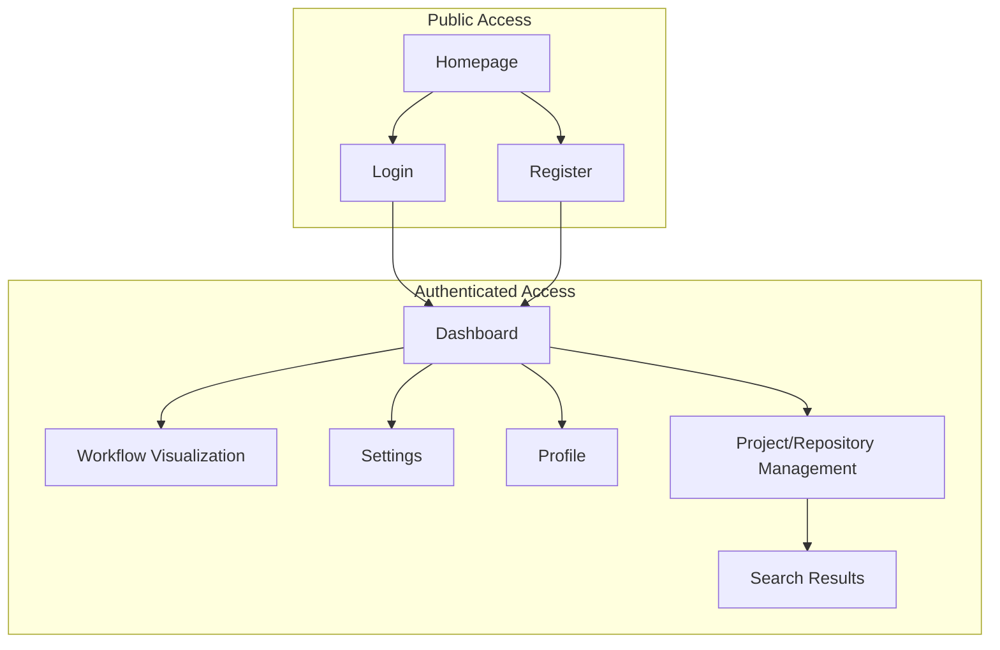
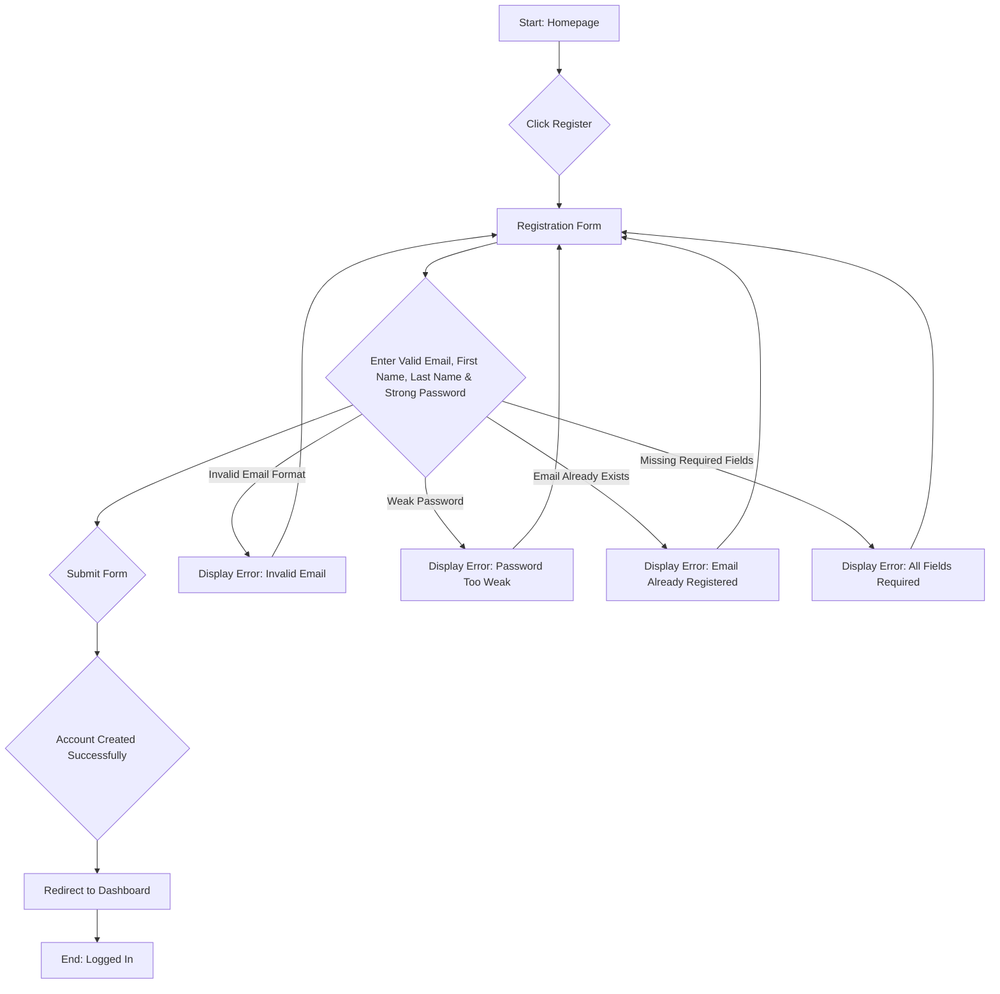
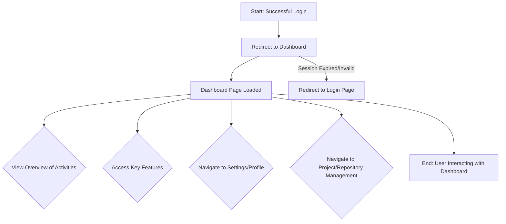
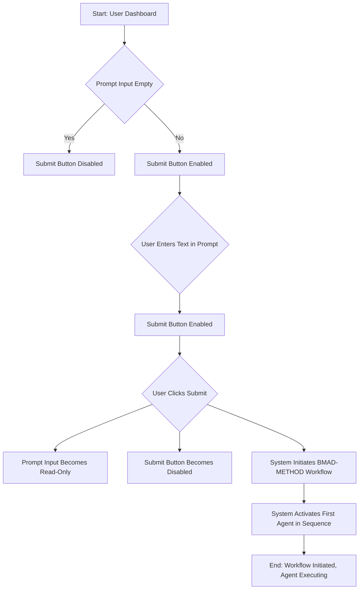
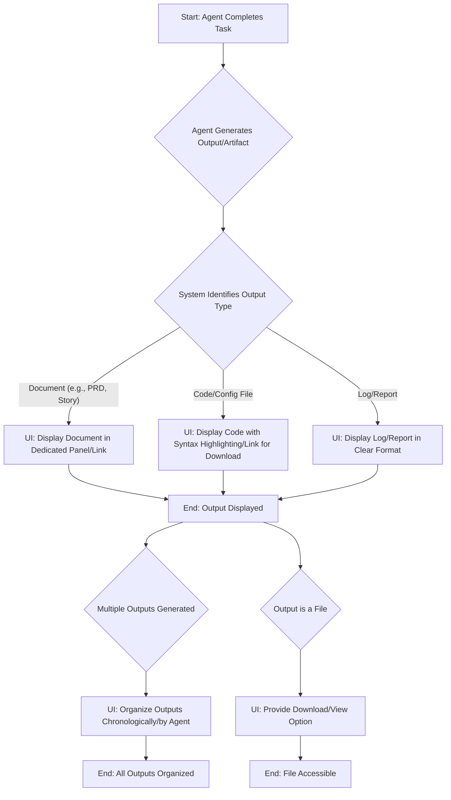

# AI Documentation Assistant UI/UX Specification

## Introduction
This document defines the user experience goals, information architecture, user flows, and visual design specifications for AI Documentation Assistant's user interface. It serves as the foundation for visual design and frontend development, ensuring a cohesive and user-centered experience.

## Overall UX Goals & Principles

#### Target User Personas
- Developers and project managers: Seeking to automate workflow management using autonomous agents.
- Technical users: Looking for a simple interface to manage and monitor automated workflows.
- Team leads: Who want real-time transparency into project status and work progress.

#### Usability Goals
- Provide a clear and accessible interface to view the status of automated workflows and agents.
- Visually present progress and status for each agent in a straightforward manner.
- Enable users to receive real-time information about processes and inter-agent communication.
- Ensure a smooth user experience with minimal manual intervention.

#### Design Principles
1.  **Simplicity:** A clean, uncluttered interface emphasizing clarity and conciseness.
2.  **Transparency:** Clear presentation of workflow and agent statuses.
3.  **Interactivity:** Ability to view detailed process steps and messages between agents.
4.  **Responsiveness:** Fast, reliable interface with real-time updates.

#### Change Log
| Date | Version | Description | Author |
|---|---|---|---|
| 2025-07-30 | 1.0 | Initial Draft | UX Expert |

## Information Architecture (IA)

#### Site Map / Screen Inventory



#### Navigation Structure

**Primary Navigation:**
- **Global Header/Footer (Logged Out):** Links to Login, Register.
- **Global Header/Footer (Logged In):** Links to Dashboard, Settings, Profile, Privacy Policy, About Us.
- **Dashboard Navigation:** Links to Workflow Visualization, Settings, Profile, Project/Repository Management.

**Secondary Navigation:**
- Contextual navigation within specific sections (e.g., sub-sections within Project/Repository Management).

**Breadcrumb Strategy:**
- **No breadcrumbs will be used** for navigation in the MVP to maintain a simpler interface.

## User Flows

#### User Registration

**User Goal:** To successfully create a new account and gain access to the application.

**Entry Points:** Homepage (via "Register" button/link).

**Success Criteria:** User account created, user logged in, and redirected to the dashboard.

**Flow Diagram:**



**Edge Cases & Error Handling:**
- Invalid email format: Display inline error message.
- Password not meeting strength requirements: Display inline error message.
- Email already registered: Display inline error message.
- Missing required fields (First Name, Last Name, Email, Password): Display inline error message.
- Network error during submission: Display generic error message and allow retry.

**Notes:**
- Password confirmation field is assumed to be part of the "Enter Valid Email & Strong Password" step.
- Success leads directly to login and dashboard access.
- First Name and Last Name fields are required for a complete user profile.

#### User Login

**User Goal:** To securely access a personalized workspace as a registered user.

**Entry Points:** Homepage (via "Login" button/link), or after successful registration.

**Success Criteria:** User successfully logged in and redirected to the personalized dashboard.

**Flow Diagram:**

```mermaid
graph TD
    A[Start: Homepage/Registration Success] --> B{Click Login};
    B --> C[Login Form];
    C --> D{Choose Login Method};

    D -- Email/Password --> E[Enter Email & Password];
    E --> F{Submit Form};
    F --> G{Credentials Validated};
    G --> H[Redirect to Dashboard];
    H --> I[End: Logged In];

    D -- Google Login --> J{Click "Sign in with Google"};
    J --> K{Google Authentication};
    K -- Success --> G;
    K -- Failure/Cancel --> L[Display Error: Google Auth Failed];
    L --> C;

    F -- Invalid Credentials --> M[Display Error: Invalid Email or Password];
    M --> C;
```

**Edge Cases & Error Handling:**
- Invalid email/password: Display inline error message.
- Google authentication failure/cancellation: Display appropriate error message.
- Network error during submission: Display generic error message and allow retry.
- Session persistence: User remains logged in across browser sessions (handled implicitly by successful login).

**Notes:**
- The login form will provide options for both email/password and Google login.
- Successful login for either method leads to the dashboard.

#### User Dashboard Access

**User Goal:** To view an overview of personal activities and access key features after logging in.

**Entry Points:** After successful login, or direct navigation to the dashboard URL while authenticated.

**Success Criteria:** User successfully lands on and interacts with their personalized dashboard.

**Flow Diagram:**



**Edge Cases & Error Handling:**
- Session expired or invalid: User is redirected to the login page.
- Network issues preventing data load: Display a loading indicator or error message for dashboard content.
- Unauthorized access attempt: Redirect to login page with an appropriate message.

**Notes:**
- The dashboard will serve as the central hub for authenticated users.
- "Key Features" will include links or widgets related to BMAD agent integration and workflow visualization.

#### Access Standard Information Pages

**User Goal:** To understand the application's terms and purpose by accessing standard information pages.

**Entry Points:** Links in the application's footer or other designated areas (accessible only when logged in, as per the updated IA).

**Success Criteria:** User successfully navigates to and views the content of the Privacy Policy or About Us page.

**Flow Diagram:**

```mermaid
graph TD
    A[Start: Any Authenticated Page] --> B{Click "Privacy Policy" Link};
    B --> C[Privacy Policy Page Loaded];
    C --> D[End: Viewing Privacy Policy];

    A --> E{Click "About Us" Link};
    E --> F[About Us Page Loaded];
    F --> G[End: Viewing About Us];
```

**Edge Cases & Error Handling:**
- Page not found (404): Display a generic error page.
- Network issues preventing content load: Display a loading indicator or error message.

**Notes:**
- These pages are static content and do not require complex interactions.
- Access to these pages is restricted to logged-in users, as per the updated Information Architecture.

#### Initiate BMAD Workflow via User Prompt

**User Goal:** To start an automated BMAD workflow by providing initial input.

**Entry Points:** User Dashboard (main input prompt).

**Success Criteria:** The BMAD-METHOD workflow is initiated, and the first agent in the sequence begins execution.

**Flow Diagram:**



**Edge Cases & Error Handling:**
- Prompt input empty: Submit button remains disabled.
- User attempts to edit prompt after submission: Input field is read-only, preventing modification.
- User attempts multiple submissions: Submit button is disabled after the first click, preventing redundant triggers.
- System error during initiation: Display a generic error message to the user.

**Notes:**
- This flow focuses on the initiation trigger and user interaction controls.
- The "text" entered by the user will serve as the initial input for the BMAD workflow.
- The visualization of progress is handled in Epic 3.

#### Load and Manage BMAD Agent Definitions

**System Goal:** To correctly load and manage the definitions of BMAD agents and their dependencies, so that agents can execute their tasks and workflows as intended.

**Entry Points:** BMAD-METHOD Workflow Initiation (triggered by Story 2.1).

**Success Criteria:** All necessary agent definitions and their dependencies are successfully loaded and ready for execution.

**Flow Diagram:**

```mermaid
graph TD
    A[Start: Workflow Initiated] --> B{Access BMAD Agent Definitions};
    B --> C[Parse Agent YAML Definitions];
    C --> D{Identify Required Dependencies};
    D --> E[Load Dependencies (Tasks, Templates, Checklists, Data)];
    E --> F{Verify Resource Availability};
    F --> G{Adhere to Agent Activation Instructions/Core Principles};
    G --> H[End: Agent Definitions Loaded & Managed];

    F -- Resource Not Found --> I[Log Error: Missing Resource];
    I --> H;
    C -- Parsing Error --> J[Log Error: Invalid Agent Definition];
    J --> H;
```

**Edge Cases & Error Handling:**
- Missing or invalid agent YAML definitions: Log an error and potentially halt the workflow or skip the affected agent.
- Missing required dependencies (task files, templates, etc.): Log an error and prevent the agent from executing its task.
- Failure to adhere to activation instructions/core principles: This is an internal system failure that should be logged and potentially trigger a workflow halt.

**Notes:**
- This flow is primarily internal to the system and does not involve direct user interaction.
- Successful completion of this flow ensures the operational readiness of the BMAD agents for sequential execution.
- The successful loading and management of these definitions (as per this flow) is crucial for enabling the sequential triggering of agents upon task completion, as described in Story 2.1.

#### Visualize Active Agent and Inter-Agent Communication

**User Goal:** To visually track the active BMAD agent and see the communication between agents, so that I can understand the workflow's progress and internal operations.

**Entry Points:** BMAD Workflow Running (after initiation from Epic 2).

**Success Criteria:** The active agent is clearly highlighted, its status is updated, and inter-agent messages are displayed in a chat panel.

**Flow Diagram:**

```mermaid
graph TD
    A[Start: Workflow Running] --> B{Agent Becomes Active};
    B --> C[UI: Highlight Agent Border];
    B --> D[UI: Set Agent Status to "Active"];
    D --> E{Agent Completes Task};
    E --> F[UI: Set Agent Status to "Idle"];
    F --> G[End: Agent Visuals Updated];

    A --> H{Agent Sends Message to Another Agent};
    H --> I[System: Capture Inter-Agent Message];
    I --> J[UI: Display Message in Chat Panel];
    J --> K[End: Message Displayed];
```

**Edge Cases & Error Handling:**
- UI rendering issues: Ensure robust UI components that can handle rapid status updates and message streams.
- High volume of messages: Implement scrolling, message limits, or filtering in the chat panel to maintain usability.
- Agent failure: The agent's status should reflect an error state, and relevant error messages should be displayed in the chat panel.

**Notes:**
- The "chat panel" is a dedicated area in the UI for displaying inter-agent communication.
- The visual highlighting and status updates should be near real-time to provide immediate feedback to the user.

#### Display Overall Workflow Status and Progress

**User Goal:** To see the overall status of the BMAD workflow and which step is currently being executed, so that I can understand the high-level progress of the automated process.

**Entry Points:** BMAD Workflow Running (after initiation from Epic 2).

**Success Criteria:** A clear indicator of the overall workflow status is displayed, and the current step/phase is updated automatically.

**Flow Diagram:**

```mermaid
graph TD
    A[Start: Workflow Initiated] --> B{System Determines Overall Workflow Status};
    B --> C[UI: Display Overall Status (e.g., "Running", "Paused", "Completed", "Error")];
    C --> D{System Identifies Current Workflow Step/Phase};
    D --> E[UI: Display Current Step/Phase (e.g., "Analyst Phase", "PM Phase")];

    E --> F{Workflow Progresses to Next Step};
    F --> D;

    C -- Workflow Completes --> G[UI: Set Status to "Completed"];
    C -- Error Occurs --> H[UI: Set Status to "Error" & Display Message];
```

**Edge Cases & Error Handling:**
- System fails to determine status: Display a "Status Unknown" or similar message.
- Rapid phase changes: Ensure the UI updates smoothly without flickering.
- Unhandled errors: The system should gracefully transition to an "Error" state and provide a user-friendly message.

**Notes:**
- This visualization complements the detailed agent-level view from Story 3.1.
- The "current step/phase" could be derived from the active agent's role or the specific task being executed.

#### Display Agent-Generated Output/Artifacts

**User Goal:** To see the documents, code, or other artifacts generated by the BMAD agents during the workflow, so that I can review the tangible results of the automated process.

**Entry Points:** BMAD Workflow Running (as agents complete tasks).

**Success Criteria:** Generated outputs are displayed in a dedicated panel, organized, and accessible for review or download.

**Flow Diagram:**



**Edge Cases & Error Handling:**
- Large files: Implement pagination or lazy loading for large documents/logs to prevent performance issues.
- Unsupported file types: Display a message indicating the file type is not supported for direct viewing, but provide a download option.
- Corrupted output: Display an error message and indicate the output is corrupted.
- Failure to save output: Log an error and notify the user if an expected output is missing.

**Notes:**
- The "dedicated output panel" should be a prominent area in the UI.
- Organization of outputs is crucial for user review, especially in longer workflows.

## Wireframes & Mockups

#### Primary Design Files: Figma (Link to be provided)

#### Key Screen Layouts: *(To be defined)*

## Component Library / Design System

#### Design System Approach: Custom, lightweight design system built with Tailwind CSS.
*(This approach leverages Tailwind's utility-first capabilities to build reusable components tailored to the project's needs, ensuring consistency and efficiency.)*

#### Core Components:
*   **Buttons:** Primary, secondary, tertiary, and icon-only buttons with various states (hover, active, disabled, loading).
*   **Input Fields:** Text, email, password input fields with validation states (error, success).
*   **Forms:** Standard form layouts for login, registration, and settings.
*   **Modals/Dialogs:** For confirmations, alerts, and temporary user interactions.
*   **Cards:** Used for displaying agent status, workflow steps, and potentially project overviews on the dashboard.
*   **Chat Bubbles/Messages:** For displaying inter-agent communication in the chat panel.
*   **Navigation Elements:** Header, sidebar navigation links, and potentially a footer.
*   **Status Indicators:** Small visual elements to show active/idle status for agents or workflow steps.
*   **Loading Spinners/Indicators:** For asynchronous operations.

## Branding & Style Guide

#### Visual Identity
The application's visual identity should convey professionalism, innovation, and user-friendliness. Given that this is an AI-powered documentation assistant, a modern, clean, and minimalist look with readable typography and calming colors is recommended.

#### Color Palette
*   **Primary Color:** Blue (#2563EB) or dark green — colors that evoke trust and professionalism.
*   **Secondary Color:** Light gray or soft teal.
*   **Status Colors:** Green for success, red for errors, yellow for warnings.
*   **Background Color:** White or off-white to facilitate long reading sessions.

#### Typography
*   **Font Families:** Recommended to use modern and readable fonts such as Inter, Open Sans, or Roboto.
*   **Font Sizes:** Clear and large headings (e.g., H1 size 24-28px), normal text size 14-16px.
*   **Line Height:** Comfortable spacing with a line-height of around 1.4 for readability.

#### Iconography
*   **Icon Library:** Prefer free icon libraries like FontAwesome, Feather Icons, or Heroicons.
*   **Usage Guidelines:** Simple and clear line-style icons to match the clean aesthetic. Use commonly recognized icons for frequent actions (settings, search, submit, etc.).

#### Spacing & Layout
*   **Grid System:** Use grid or flexbox for neat content alignment.
*   **Spacing Scale:** Consistent padding and margin values (e.g., 8px, 16px, 24px).
*   **Layout Principles:** Divide content into cards or blocks with clear spacing to avoid clutter.

## Accessibility Requirements

#### Compliance Target
**Standard:** None specified for MVP beyond general web accessibility best practices.

#### Key Requirements
**Visual:**
- Color contrast ratios: Ensure sufficient contrast for readability (e.g., WCAG AA minimums for text).
- Focus indicators: Provide clear visual focus indicators for keyboard navigation.
- Text sizing: Allow browser-based text resizing without loss of content or functionality.

**Interaction:**
- Keyboard navigation: All interactive elements should be navigable and operable via keyboard.
- Screen reader support: Basic support for screen readers for core content and interactive elements.
- Touch targets: Ensure adequate touch target sizes for interactive elements on touch-enabled devices.

**Content:**
- Alternative text: Provide descriptive alt text for all meaningful images.
- Heading structure: Use semantic HTML heading tags (H1, H2, etc.) to define content hierarchy.
- Form labels: Associate all form inputs with descriptive labels.

#### Testing Strategy
*(To be defined later, likely manual testing for MVP.)*

## Responsiveness Strategy

#### Breakpoints
| Breakpoint | Min Width | Max Width | Target Devices      |
|------------|-----------|-----------|---------------------|
| Mobile     | 0px       | 639px     | Smartphones (portrait) |
| Tablet     | 640px     | 1023px    | Tablets (portrait/landscape), small laptops |
| Desktop    | 1024px    | 1279px    | Standard Desktops   |
| Wide       | 1280px    | -         | Large Monitors      |

#### Adaptation Patterns
**Layout Changes:**
- Content will reflow and stack vertically on smaller screens.
- Columns will collapse into single columns or adjust their width based on available space.
- Navigation elements may transform (e.g., from a horizontal bar to a hamburger menu on mobile).

**Navigation Changes:**
- Primary navigation will adapt to a mobile-friendly pattern (e.g., off-canvas menu, hamburger icon) on smaller screens.
- Secondary navigation may be hidden or presented in an accordion/tab format.

**Content Priority:**
- Essential content will remain prominent across all screen sizes.
- Less critical information or supplementary content may be hidden or accessible via expansion on smaller screens.

**Interaction Changes:**
- Touch-friendly interactions will be prioritized on mobile and tablet devices.
- Hover states may be removed or adapted for touch interfaces.

## Animation & Micro-interactions

#### Motion Principles
-   **Purposeful:** Animations should serve a clear purpose, guiding the user's attention, providing feedback, or enhancing understanding.
-   **Subtle:** Avoid overly distracting or gratuitous animations. They should be smooth and enhance the experience without being overwhelming.
-   **Consistent:** Apply motion principles consistently across the application for a predictable user experience.
-   **Performant:** Animations should run smoothly at 60fps (frames per second) to avoid jankiness.

#### Key Animations
-   **Button/Click Feedback:** Subtle visual feedback (e.g., slight scale, color change) on button clicks or interactive element taps.
-   **Form Validation:** Gentle animations for input field validation (e.g., a subtle shake for errors, a checkmark for success).
-   **Loading Indicators:** Smooth, non-distracting loading animations for content fetching or process execution.
-   **Agent Status Transitions:** Visual transitions when an agent's status changes (e.g., from "Idle" to "Active").
-   **Chat Message Entry:** New messages in the chat panel could subtly slide in or fade up.

## Performance Considerations

#### Performance Goals
-   **Page Load:** Aim for fast initial page load times (e.g., under 2-3 seconds on a typical broadband connection).
-   **Interaction Response:** User interactions (e.g., button clicks, form submissions) should feel instantaneous, with feedback provided within milliseconds.
-   **Workflow Visualization Updates:** Real-time updates for agent status and inter-agent communication should be near-instantaneous, minimizing perceived latency.

#### Design Strategies
-   **Lazy Loading:** Implement lazy loading for non-critical assets (e.g., images, components below the fold) to improve initial page load.
-   **Optimized Assets:** Use optimized images, fonts, and other media to reduce file sizes.
-   **Efficient UI Updates:** Design UI components to update efficiently, minimizing re-renders and DOM manipulations, especially for dynamic content like chat panels.
-   **Feedback Mechanisms:** Provide clear loading indicators and skeleton screens for asynchronous operations to manage user expectations.
-   **Minimize Network Requests:** Batch API calls where possible and leverage caching strategies.

## Next Steps

#### Immediate Actions
1.  Review and validate this UI/UX Specification with key stakeholders.
2.  Begin creating detailed visual designs and prototypes in Figma based on this specification.
3.  Prepare for handoff to the Architect for frontend architecture planning.
    *   **Note for Architect:** Consider using React-Query for efficient data fetching and state management in the frontend.

#### Design Handoff Checklist
*   All user flows documented
*   Component inventory complete
*   Accessibility requirements defined
*   Responsive strategy clear
*   Brand guidelines incorporated
*   Performance goals established
